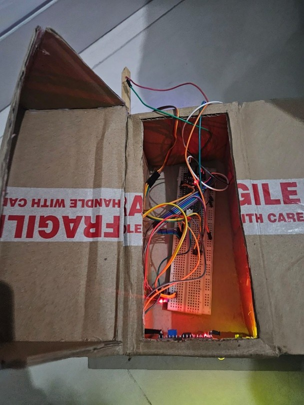
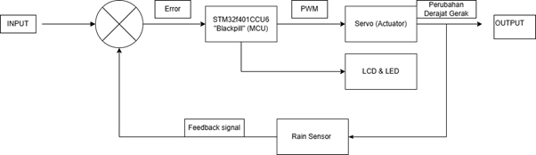
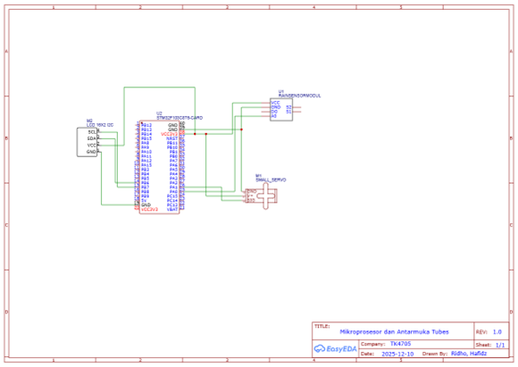
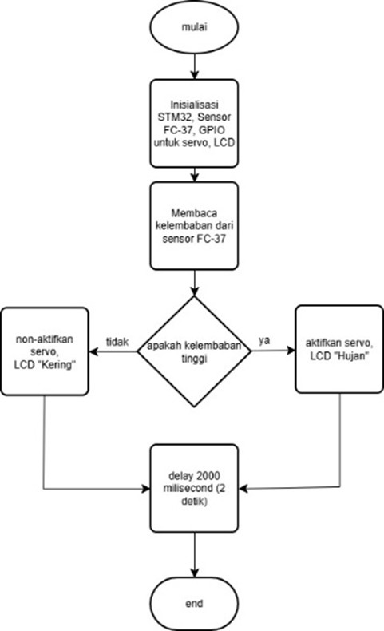
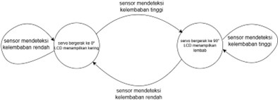
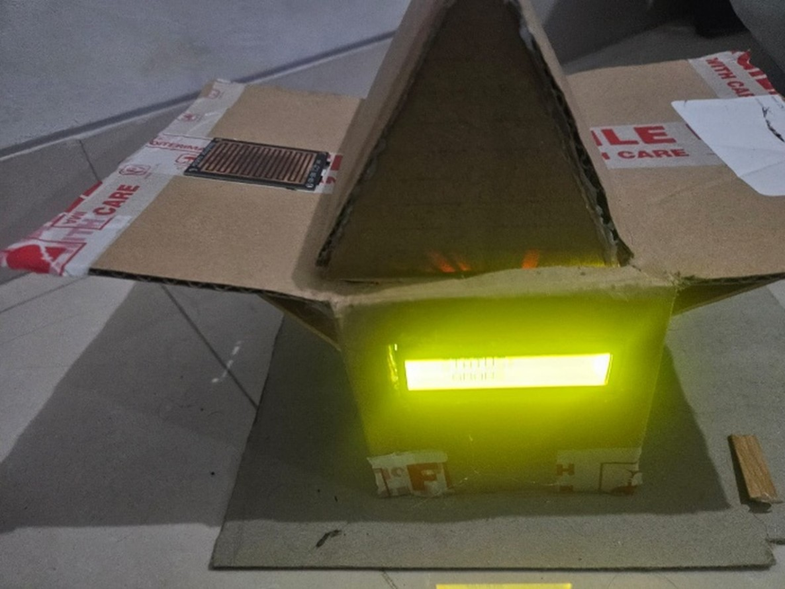
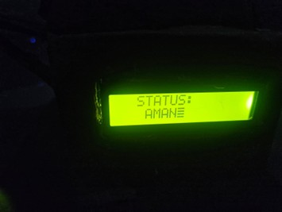
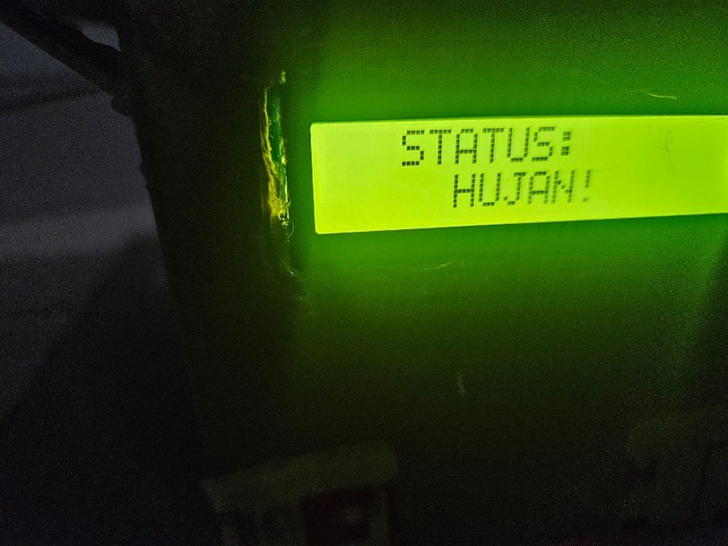
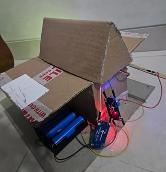

# STM32 Rain-Activated Switch System

## Overview
This project implements an STM32-based embedded automation system capable of detecting rain conditions and automatically triggering a physical response mechanism. The system utilizes real-time sensor monitoring, PWM motor control, ADC data acquisition, and I2C communication to create a responsive home automation prototype.

The project was developed using low-level Embedded C programming (CMSIS/register-based) without relying on high-level abstraction libraries.

---

## Hardware Prototype

---

## Features
- Rain detection using FC-37 sensor
- Real-time environmental monitoring
- Servo motor automation using PWM
- LCD status display using I2C communication
- ADC-based sensor data acquisition
- Low-level STM32 peripheral programming
- State-machine-based system behavior

---

## Hardware Components
- STM32F401CCU6
- FC-37 Rain Sensor
- Servo Motor
- I2C LCD Display
- Breadboard & Jumper Wires
- Power Supply Module

---

## Software & Technologies
- Embedded C
- CMSIS / Register-Based Programming
- STM32CubeIDE
- ADC Configuration
- PWM Signal Generation
- I2C Communication
- GPIO Configuration

---

## System Architecture

### Block Diagram

---
### Circuit Schematic

---

### Flowchart

---

### State Machine

---

## System Workflow
1. FC-37 rain sensor detects environmental conditions.
2. STM32 ADC reads sensor values continuously.
3. System determines rain status based on threshold values.
4. LCD displays system condition ("Rain" / "Safe").
5. PWM signal controls servo motor response automatically.
6. State machine manages system transitions and behavior.

---

## Embedded System Implementation

### ADC
Used for analog sensor data acquisition from the FC-37 rain sensor.

### PWM
Configured using STM32 hardware timers to control servo motor movement.

### I2C
Implemented for LCD communication and real-time status display.

### GPIO
Used for peripheral interfacing and system control.

---

## Testing & Evaluation
The system was tested to evaluate:
- Sensor responsiveness
- Servo motor accuracy
- LCD communication reliability
- Real-time system response
- Embedded system stability

System evaluation was performed through repeated sensor testing and operational monitoring under different environmental conditions.

---

## Challenges & Solutions

| Challenges | Solutions |
|---|---|
| Sensor instability | Adjusted threshold and filtering logic |
| Servo response inconsistency | Optimized PWM configuration |
| LCD communication errors | Refined I2C timing and initialization |

---

## Results
- Successfully implemented real-time rain detection and automated response system.
- Achieved stable STM32 peripheral communication using ADC, PWM, and I2C.
- Improved system reliability through debugging and system optimization.

---

## Documentation
[Project Report](docs/stm32_rain_system_report.pdf)

---

## Additional Images

### Front Setup

### LCD Status - Safe Condition

### LCD Status - Rain Detected

### Internal Hardware

### System Response Demonstration
The video below demonstrates automatic rain detection, LCD status updates, and servo motor actuation in real time.
[System Demonstration](images/system_demo.mp4)

---

## Future Improvements
- Add wireless monitoring capability
- Implement low-power optimization
- Improve enclosure durability
- Add real-time weather logging

---

## Author
Muhammad Hafidz Abdurrahman